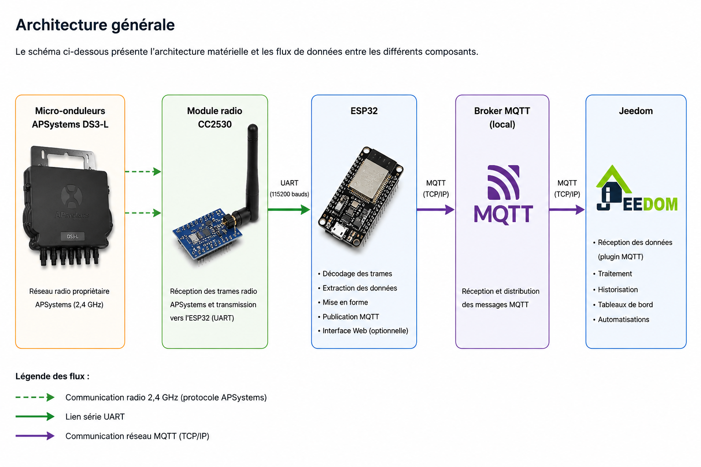

# Architecture générale

## Vue d'ensemble

Cette page présente l'architecture retenue pour récupérer localement les données de production des micro-onduleurs APSystems.

L'objectif est de s'affranchir totalement du cloud constructeur pour la collecte et l'exploitation des données.

L'ensemble de la chaîne fonctionne sur le réseau local.

## Architecture de la solution

## Description des composants

### Micro-onduleurs APSystems DS3-L

Les micro-onduleurs produisent les mesures de fonctionnement :

* puissance instantanée ;
* tension ;
* courant ;
* énergie produite ;
* température interne ;
* état de fonctionnement.

Les données sont émises périodiquement sous forme de trames propriétaires APSystems.

La couche radio utilisée repose sur la norme IEEE 802.15.4 à 2,4 GHz.

APSystems n'utilise toutefois pas le protocole Zigbee mais un protocole propriétaire transporté sur cette couche radio.

---

### Module radio CC2530

Le CC2530 assure la réception des trames radio émises par les micro-onduleurs.

Son rôle est limité à :

* recevoir les trames IEEE 802.15.4 ;
* transmettre les données brutes vers l'ESP32 via une liaison série UART.

Le décodage des informations n'est pas réalisé par le CC2530 mais par l'ESP32.

---

### ESP32

L'ESP32 constitue le cœur du système.

Il exécute le firmware issu du projet :

[ESP32-read-APS-inverters](https://github.com/patience4711/ESP32-read-APS-inverters)

Ses principales fonctions sont :

* réception des trames provenant du CC2530 ;
* décodage du protocole APSystems ;
* extraction des mesures ;
* mise en forme des données ;
* publication MQTT ;
* exposition éventuelle d'interfaces locales.

---

### Broker MQTT

Le broker MQTT sert de point central de diffusion des informations.

L'ESP32 publie les données de production sous forme de topics MQTT.

Cette approche présente plusieurs avantages :

* découplage des producteurs et consommateurs ;
* intégration simple avec les systèmes domotiques ;
* historisation facilitée ;
* évolutivité.

---

### Jeedom

Jeedom exploite les données publiées sur MQTT.

Les usages mis en œuvre sont notamment :

* affichage des mesures temps réel ;
* historisation ;
* tableaux de bord énergétiques ;
* scénarios d'automatisation ;
* supervision de la production photovoltaïque.

---

## Principes retenus

Cette architecture répond aux objectifs suivants :

* fonctionnement 100 % local ;
* indépendance vis-à-vis du cloud APSystems ;
* faible coût matériel ;
* simplicité de maintenance ;
* intégration native dans un environnement domotique ;
* possibilité d'évolution future.

## Résultat obtenu

L'ensemble des données de production est désormais accessible localement et peut être exploité indépendamment de toute plateforme externe.

L'architecture constitue ainsi une base robuste pour la supervision énergétique de l'installation photovoltaïque.
