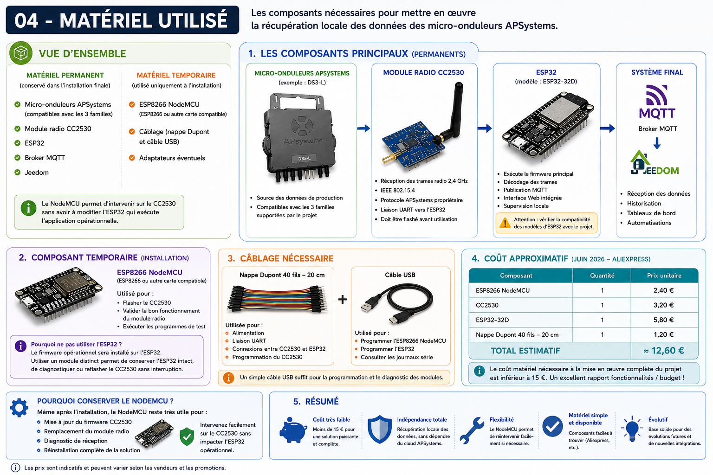

# Matériel utilisé

## Objectif

Cette page présente les différents composants matériels utilisés pour mettre en œuvre la solution.

Les références présentées correspondent à l'installation utilisée pour ce retour d'expérience.

---

## Vue d'ensemble

Le matériel se répartit en deux catégories :

### Matériel permanent

Composants conservés dans l'installation finale :

* Micro-onduleurs APSystems
* Module radio CC2530
* ESP32
* Broker MQTT
* Jeedom

### Matériel temporaire

Composants utilisés uniquement durant l'installation :

* ESP8266 NodeMCU
* Câblage de programmation
* Adaptateurs éventuels

---

## Micro-onduleurs APSystems

### Rôle

Les micro-onduleurs constituent la source des données de production.

Ils transmettent périodiquement :

* puissance instantanée ;
* tension ;
* courant ;
* énergie produite ;
* informations de fonctionnement.

### Compatibilité

Ce retour d'expérience a été réalisé avec des micro-onduleurs APSystems DS3-L.

Le projet ESP32-read-APS-inverters est toutefois compatible avec les trois principales familles de micro-onduleurs APSystems supportées par le projet d'origine.

Le choix du DS3-L dans cette documentation correspond simplement à l'installation utilisée pour les tests.

---

## Module radio CC2530

### Rôle

Le CC2530 reçoit les trames radio émises par les micro-onduleurs.

### Particularités

* fréquence 2,4 GHz ;
* communication IEEE 802.15.4 ;
* protocole APSystems propriétaire ;
* liaison UART vers l'ESP32.

### Remarques

Le module doit être flashé avant utilisation.

---

## ESP32

### Rôle

L'ESP32 exécute le firmware principal.

### Fonctions assurées

* décodage des trames ;
* publication MQTT ;
* interface Web intégrée ;
* supervision locale.

### Modèle utilisé

ESP32-32D.

### Point d'attention

Le firmware ESP32-read-APS-inverters est sensible aux caractéristiques matérielles de certaines cartes ESP32.

Avant tout achat, il est recommandé de consulter la documentation officielle du projet afin de vérifier les modèles compatibles.

Dans ce retour d'expérience, l'ESP32-32D a été utilisé avec succès.

---

## ESP8266 NodeMCU

### Rôle

Un ESP8266 NodeMCU est utilisé durant les phases de préparation et de validation du CC2530.

Ses principales fonctions sont :

* flashage du firmware du CC2530 ;
* validation du bon fonctionnement du module radio ;
* exécution des programmes de test.

### Pourquoi ne pas utiliser l'ESP32 ?

Le firmware opérationnel sera installé sur l'ESP32.

L'utilisation d'un module distinct pour les opérations de maintenance permet :

* de conserver l'ESP32 intact ;
* de pouvoir reflasher ou diagnostiquer le CC2530 ultérieurement ;
* d'éviter toute interruption de la plateforme opérationnelle.

### Remarque

Le NodeMCU utilisé dans ce projet est basé sur un ESP8266.

Toute autre carte compatible permettant d'exécuter les outils de flashage du CC2530 peut être utilisée.

---

## Câblage

Le câblage nécessaire est limité à :

* alimentation ;
* liaison UART ;
* connexions de programmation du CC2530.

Les détails de câblage sont présentés dans les chapitres suivants.

---

## Coût approximatif

Prix constatés sur AliExpress en juin 2026.

| Composant                    | Quantité | Prix unitaire |
| ---------------------------- | -------- | ------------- |
| ESP8266 NodeMCU              | 1        | 2,40 €        |
| CC2530                       | 1        | 3,20 €        |
| ESP32-32D                    | 1        | 5,80 €        |
| Nappe Dupont 40 fils – 20 cm | 1        | 1,20 €        |

### Budget total

Le coût matériel nécessaire à la mise en œuvre complète du projet est inférieur à 15 €.

Ce faible coût constitue l'un des principaux atouts de la solution.

---

## Pourquoi conserver le NodeMCU ?

Une fois le projet terminé, il peut être tentant de réutiliser ou de jeter le NodeMCU.

Je recommande au contraire de le conserver.

En cas de :

* mise à jour du firmware CC2530 ;
* remplacement du module radio ;
* diagnostic de réception ;
* réinstallation complète de la solution ;

il permettra de réintervenir rapidement sans impacter l'ESP32 opérationnel.

---

## Conclusion

L'ensemble du matériel nécessaire est simple à trouver et peu coûteux.

La principale difficulté ne réside pas dans l'approvisionnement mais dans la compréhension des différentes étapes de mise en œuvre, qui seront détaillées dans les chapitres suivants.

Le coût global du projet reste particulièrement réduit au regard des fonctionnalités obtenues et de l'indépendance acquise vis-à-vis du cloud constructeur.
