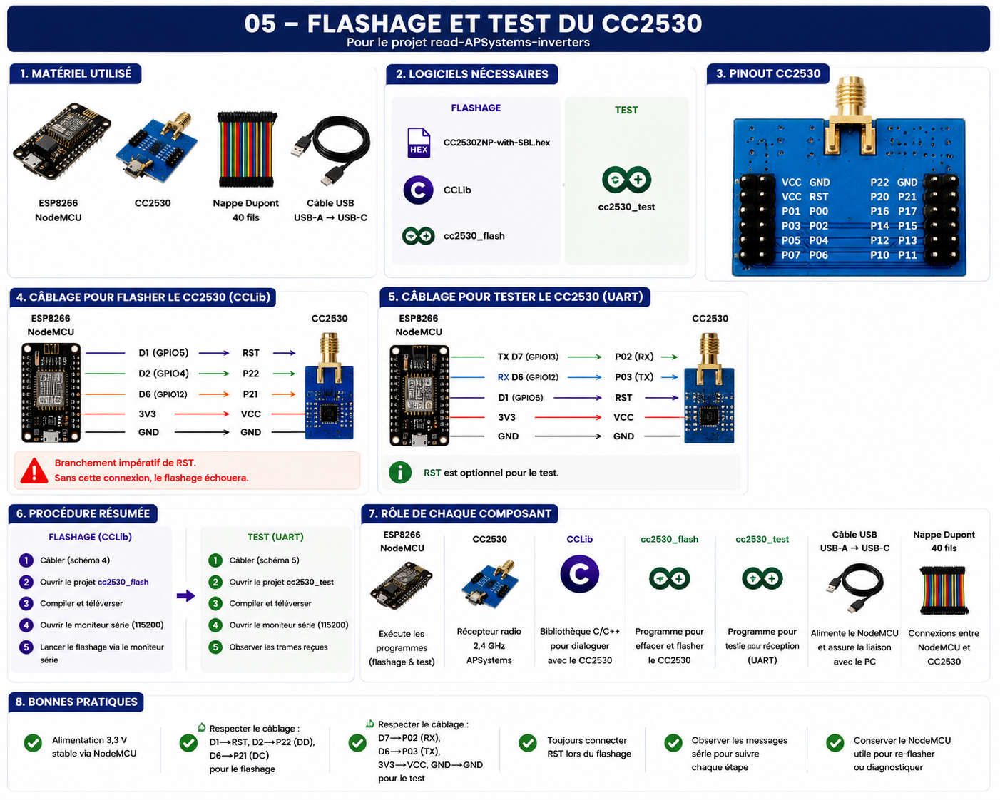

# Flashage et test du CC2530

## Objectif

Avant de pouvoir être utilisé avec le projet ESP32-read-APS-inverters, le module radio CC2530 doit être préparé.

Cette préparation comporte deux étapes :

1. Flashage du firmware spécifique APSystems.
2. Validation du bon fonctionnement du module radio.

L'objectif est de s'assurer que le CC2530 est correctement programmé avant son raccordement à l'ESP32.

---

## Vue d'ensemble



---

## Matériel nécessaire

Pour cette étape, les éléments suivants sont utilisés :

* ESP8266 NodeMCU
* Module CC2530
* Nappe Dupont 40 fils
* Câble USB-A vers USB-C

Le NodeMCU est utilisé uniquement durant les phases de flashage et de validation.

---

## Logiciels nécessaires

### Flashage

* Firmware `CC2530ZNP-with-SBL.hex`
* Bibliothèque CCLib
* Projet `cc2530_flash`

### Test

* Projet `cc2530_test`

Le programme de test n'utilise pas CCLib.

---

## Firmware utilisé

Le firmware installé dans le CC2530 est :

```text
CC2530ZNP-with-SBL.hex
```

Ce firmware est fourni dans le dépôt du projet d'origine.

Il permet au CC2530 de recevoir les trames radio émises par les micro-onduleurs APSystems et de les transmettre vers l'équipement hôte.

---

## Flashage du CC2530

### Câblage

Le câblage utilisé pour le flashage est le suivant :

| ESP8266 NodeMCU | CC2530 |
| --------------- | ------ |
| D1              | RST    |
| D2              | P22    |
| D6              | P21    |
| 3V3             | VCC    |
| GND             | GND    |

### Particularité

La connexion RST est obligatoire.

Sans cette connexion, le flashage échoue.

### Outils utilisés

* Bibliothèque CCLib
* Projet Arduino `cc2530_flash`

### Procédure

1. Réaliser le câblage de flashage.
2. Ouvrir le projet `cc2530_flash`.
3. Compiler et téléverser sur le NodeMCU.
4. Ouvrir le moniteur série.
5. Lancer la procédure de flashage.
6. Vérifier la bonne écriture du firmware.

### Commandes utilisées

Le flashage est réalisé avec Python et CCLib.

Identification du CC2530 :

```powershell
python cc_info.py
```

Lecture du contenu mémoire (optionnel) :

```powershell
python cc_read_flash.py
```

Écriture du firmware :

```powershell
python cc_write_flash.py CC2530ZNP-with-SBL.hex
```

Suivi des messages du NodeMCU :

```text
Moniteur série : 115200 bauds
```

Le flashage n'est pas réalisé avec PlatformIO ou pio. PlatformIO peut uniquement être utilisé pour compiler et téléverser le projet NodeMCU.

---

## Test du CC2530

Une fois le firmware installé, le module peut être testé.

### Câblage

| ESP8266 NodeMCU | CC2530 |
| --------------- | ------ |
| TX D7           | P02    |
| RX D6           | P03    |
| D1              | RST    |
| 3V3             | VCC    |
| GND             | GND    |

### Particularité

La connexion RST n'est généralement pas nécessaire pour le test mais peut être conservée.

### Outils utilisés

* Projet Arduino `cc2530_test`

### Procédure

1. Réaliser le câblage de test.
2. Ouvrir le projet `cc2530_test`.
3. Compiler et téléverser sur le NodeMCU.
4. Ouvrir le moniteur série.
5. Observer les trames reçues.

### Commandes utilisées

Le programme de test expose trois commandes principales :

```text
PING
```

Permet de vérifier la communication avec le CC2530.

```text
SYS_VERSION
```

Permet de vérifier la version du firmware installé.

```text
RESET
```

Permet de redémarrer le module CC2530.

Ces commandes sont envoyées depuis le moniteur série configuré à :

```text
115200 bauds
```

---

## Résultat attendu

Lorsque le CC2530 fonctionne correctement :

* le programme de test démarre sans erreur ;
* les commandes répondent correctement ;
* les trames radio APSystems sont reçues ;
* les informations sont affichées dans le moniteur série.

Le module est alors prêt à être raccordé à l'ESP32.

---

## Bonnes pratiques

* Utiliser une alimentation 3,3 V stable.
* Vérifier soigneusement le câblage avant chaque essai.
* Toujours connecter la broche RST lors du flashage.
* Contrôler les messages du moniteur série à chaque étape.
* Conserver le NodeMCU après l'installation : il sera utile pour les mises à jour ou diagnostics futurs.

---

## Retour d'expérience

La principale difficulté rencontrée lors de cette étape concerne le câblage.

Les symptômes observés en cas d'erreur sont généralement :

* impossibilité de flasher le CC2530 ;
* absence de réponse aux commandes ;
* absence de trames lors du test ;
* messages d'erreur dans le moniteur série.

Une vérification systématique des connexions permet généralement de résoudre rapidement ces problèmes.

Une fois le module validé, l'installation peut se poursuivre avec la mise en œuvre de l'ESP32 et du firmware principal.
